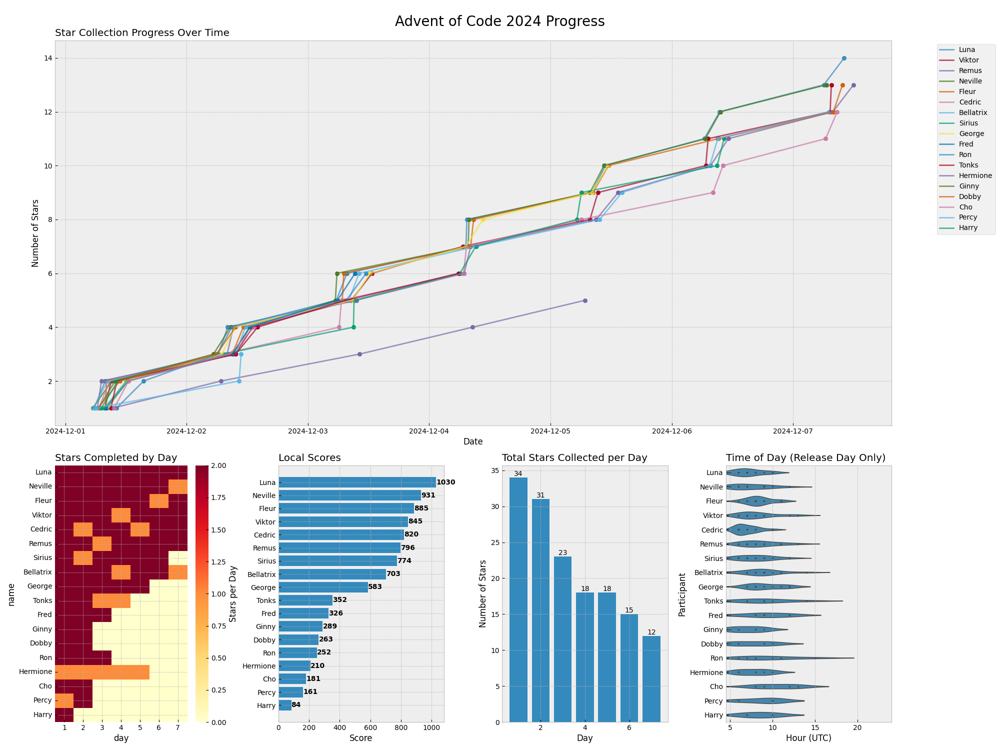

# 🎄 Advent of Code Visualizations

View trends for your private Advent of Code leaderboard.

## Features

- Progress over time
- Stars completed by day
- Local scores
- Stars collected per day
- Time of day stars are collected

Here is an example of what visualisations look like


## Data

There's (currently) no AoC API integration, so you'll need to manually download your leaderboard stats before running.
To do this this:
- Go to https://adventofcode.com/2024/leaderboard/private
- Select `View` for the leaderboard you want
- Select `[API]`
- Select `[JSON]`
- Copy contents into `leaderboard.json` file in current directory

A `demo.json` is included in the repository.

## Usage

If you have [uv](https://github.com/astral-sh/uv) installed, run:
```bash
uv run main.py
```

Otherwise, install requirements explicitly first
```bash
pip install pandas matplotlib seaborn numpy
python main.py
```

To anonymise the leaderboard, include flag `--anon` - otherwise usernames will show, as above.

To use a different json file, pass `--data={FILENAME}`.